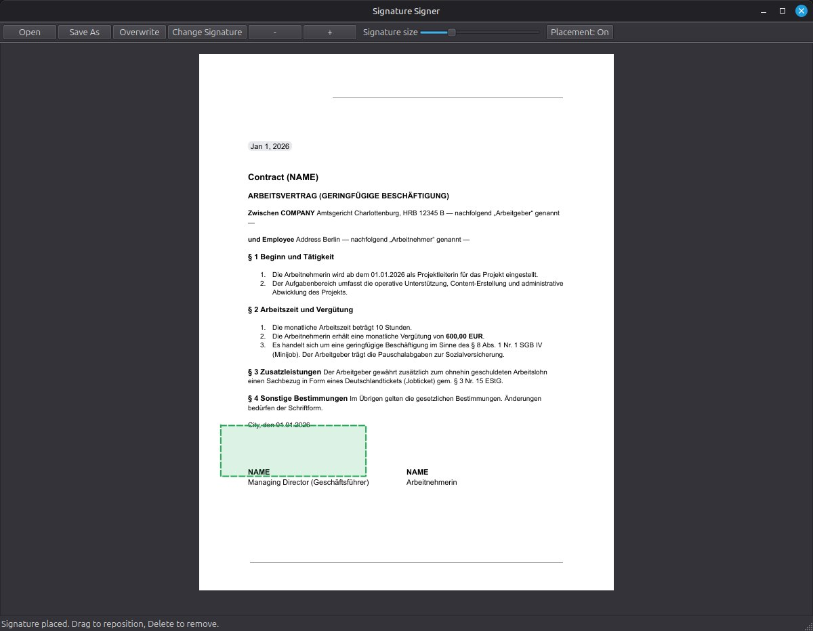

# PDF Signature Signer

A lightweight, local-first desktop app for Linux Mint and other Linux desktops that lets you place a stored PNG signature onto PDF files quickly.

Important: this app adds a visual signature image to a PDF. It does **not** create a cryptographic or certificate-based digital signature.

## Why this exists

Sometimes you just need to drop your signature onto a PDF and save it without uploading anything to a website, opening a giant editor, or dealing with printer-scanner nonsense.

This app is built for that exact job.

## Screenshot



## Features

- Local-first, no network access
- Stores a reusable signature PNG path in `~/.config/signature_signer/config.json`
- Opens PDFs from a CLI argument or file picker
- Scrollable multi-page PDF view
- Live signature preview under cursor
- Resize signature with a slider or mouse wheel while placing
- Rotate the stamp in 90° steps if a PDF or image orientation is odd
- Drag placed signatures before saving
- Delete selected signatures before saving
- Save As by default, overwrite only with confirmation

## Quick Start

```bash
git clone https://github.com/NWMBA/pdf-signature-signer.git
cd pdf-signature-signer
python3 -m venv .venv
source .venv/bin/activate
pip install -r requirements.txt
python3 -m signature_signer /path/to/file.pdf
```

The dependency versions are pinned because PDF rendering/stamping behavior can vary across PyMuPDF/MuPDF releases. If one computer works and another starts saving stamps upside down after system updates, reinstall the virtualenv from `requirements.txt` before debugging the PDF itself.

To print the active Python, PyMuPDF, Qt package versions, and optional PDF geometry diagnostics:

```bash
python3 -m signature_signer.diagnostics
python3 -m signature_signer.diagnostics /path/to/original.pdf /path/to/broken-signed.pdf
```

## Linux notes

On some Linux Mint or Ubuntu systems, PyQt6 may also need the Qt xcb cursor package:

```bash
sudo apt update
sudo apt install libxcb-cursor0
```

If Qt still complains about xcb plugin dependencies, also try:

```bash
sudo apt install libxkbcommon-x11-0 libxcb-icccm4 libxcb-keysyms1 libxcb-render-util0 libxcb-xinerama0
```

## Make it the default PDF opener

Create `~/.local/share/applications/signature-signer.desktop`:

```ini
[Desktop Entry]
Version=1.0
Type=Application
Name=Signature Signer
Comment=Sign PDFs with a stored PNG signature
Exec=/full/path/to/your/venv/bin/python -m signature_signer %f
Path=/full/path/to/pdf-signature-signer
Icon=accessories-text-editor
Terminal=false
Categories=Office;Utility;
MimeType=application/pdf;
StartupNotify=true
NoDisplay=false
```

Then run:

```bash
update-desktop-database ~/.local/share/applications
xdg-mime default signature-signer.desktop application/pdf
```

## Project status

This is a working MVP. It is intentionally simple and focused.

A few things are still rough around the edges:
- UI polish can be improved
- page rotation and unusual PDF geometry are only handled at MVP level
- packaging is still source-first rather than `.deb` or AppImage

## License

MIT
